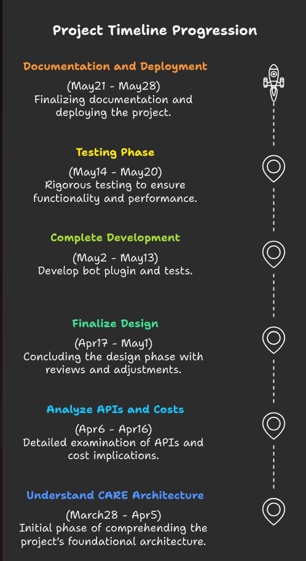

# Project Proposal

## Instant Messaging Bot Integration with Care

- **Organisation**: OHN  
- **Mentor**: Shivank Kacker, Rithvik Nishad, Vysakh Premkumar  
- **Applicant**: Anand Padmanabhan  

---

## Personal Information

### Contact Information

- **Name**: Anand Padmanabhan  
- **Email**: anandcelestis@gmail.com  
- **GitHub**: [Anand Git](https://github.com/Anand1923) *(NB: All of my work is in private repo.)*  
- **LinkedIn**: [Anand](https://www.linkedin.com/in/anand-padmanabhan-7757b2183/)  
- **Location**: Kannur, Kerala, India  
- **Timezone**: IST (UTC +5:30)  

---

## About Me

I am a Python backend developer with a mechanical engineering background and hands-on experience at a robotics company, where I worked on projects that bridged hardware and software in impactful ways.

Over time, I’ve developed a solid foundation in backend development, with practical skills in:
- Database design  
- API development  
- System integration  

I also enjoy working on automation projects and am currently exploring cloud platforms to better understand scalable system design.

Having been involved across the software development lifecycle—from planning and design to testing and deployment—I value the importance of planning, architecture and testing and how each phase affects the final user/developer experience.

At present, I’m taking a break to focus on renovating my family home and personal learning, while also offering passive technical support to a startup I was previously involved with. This downtime has ignited my enthusiasm for contributing to open-source projects.

---

## Why I Am Interested in OHN

I followed how Kerala tackled the COVID-19 pandemic and learning that OHN played a role in that really impressed me. I’d be thrilled to contribute to a project that has real-world impact and aligns with my values, interests and knowledge base.

---

# Project Description

## Abstract

The CARE system provides hospital and patient management infrastructure to streamline healthcare services. This project aims to integrate a **Whatsapp chatbot** into the CARE backend, improving communication efficiency for:
- Patients  
- Hospital staff  
- Nurses  

By leveraging Whatsapp's accessibility, the bot will facilitate quick responses, appointment scheduling and essential healthcare interactions, reducing the dependency on web apps. This will save time for all stakeholders and enhance the user experience, particularly for those unfamiliar with web applications.

---

## Benefits to the Community

- **Time Efficiency**: Patients, nurses and hospital staff have critical time constraints. A Whatsapp bot reduces interaction friction and improves response time.
- **Cost Reduction**: Hospitals save on resources by automating routine queries and appointment management.
- **Ease of Use**: Many patients may not be comfortable using web apps. Whatsapp is widely used and familiar.
- **Enhanced Patient Engagement**: Provides real-time responses and proactive reminders, leading to better healthcare outcomes.

---

## Proposed Features

- **User Data Retrieval**:  
  - Patients can fetch their records, medications, procedures and schedules.  
  - Hospital staff can access patient records, schedules and updates.  
- **Appointment Management**: Booking, rescheduling via Whatsapp.  
- **Automated Notifications**: CARE system sends appointment reminders, test results and emergency alerts.  
- **Resource Management**: Admin oversees critical hospital resources, including bed availability and allocation.  

---

## Technical Specifications

### Architecture
- Develop a new plugin while adhering to the standard coding format used in existing plugins.

### Data Flow
1. Users request information via Whatsapp and the bot retrieves data from the CARE backend.
2. CARE system sends automated notifications and updates to users via Whatsapp.

---

## Implementation Plan

### **Phase 1: Research & Planning**
- Understand CARE’s backend structure.
- Analyze Whatsapp Business API and webhook.
- Understand user usage patterns and cost estimation.
- Review OHN’s guidelines on setting up a Whatsapp Business account and selecting the appropriate phone number for integration.
- Finalize the design document.

### **Phase 2: Development**
- Implement core bot functionalities (authentication, appointment handling, query processing).
- Build API endpoints for communication.
- Establish database schema for bot interactions.

### **Phase 3: Testing & Optimization**
- Conduct unit and integration tests.
- Load testing to ensure scalability.
- Optimize response time and error handling.

### **Phase 4: Deployment & Documentation**
- Deploy the bot on a cloud server.
- Write usage and maintenance documentation.
- Gather feedback and improve functionalities if any.

---

## Testing Plan

- **Unit tests** for bot interactions and API responses.
- **Security tests** to prevent unauthorized access.

---

## Relevant Experience

I have developed and maintained microservice systems using:
- **Python FastAPI** and **Node.js**
- **PostgreSQL**, **Redis** and **queue systems**
- **Cloud-based deployments**

My experience includes:
- Designing scalable backend architectures
- Implementing API-driven integrations
- Ensuring system reliability by integrating message queues, optimizing database queries and designing fault-tolerant systems

This experience directly aligns with the requirements of this project, as the Whatsapp bot will require efficient API design, database management and real-time messaging capabilities.

---

## Timeline

| Phase   | Date           | Task  |
|---------|--------------|------------------------------------------------|
| **Phase 1**  | Mar 28 - Apr 5  | Understand CARE architecture  |
| **Phase 1**  | Apr 6 - Apr 16  | Analyze Whatsapp API, Webhook, Message Templates and Cost Estimation  |
| **Phase 1**  | Apr 16 - May 1  | Finalize design and review  |
| **Phase 2**  | May 1 - May 7   | Complete development  |
| **Phase 3**  | May 8 - May 20  | Unit, Integration and Load Testing  |
| **Phase 4**  | May 21 - May 28 | Final Documentation and Deployment  |

---

## Conclusion
This project will provide a seamless communication channel between healthcare providers and patients, ensuring timely responses, improved hospital resource management and better patient engagement. By leveraging Whatsapp’s widespread adoption, the system will be user-friendly and highly accessible.
